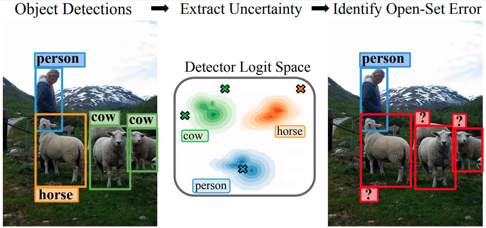

# Uncertainty for Identifying Open-Set Errors in Visual Object Detection
*** Currently under construction, due date in 2 weeks ***

This repository contains the training and evaluation code from the paper:

**Uncertainty for Identifying Open-Set Errors in Visual Object Detection**

*Dimity Miller, Niko Suenderhauf, Michael Milford, Feras Dayoub*

<!--  -->
<p align="center">
  
</p>

If you use this repository, please cite:

```text
@article{miller2021uncertainty,
  title={Uncertainty for Identifying Open-Set Errors in Visual Object Detection},
  author={Miller, Dimity and S{\"u}nderhauf, Niko and Milford, Michael and Dayoub, Feras},
  journal={IEEE Robotics and Automation Letters}, 
  year={2021},
  pages={1-1},
  doi={10.1109/LRA.2021.3123374}
}
```

**Contact**

If you have any questions or comments, please contact [Dimity Miller](mailto:d24.miller@qut.edu.au).

**Progress**
- [x] Dataset setup (ETA: 1 day)
- [x] Faster R-CNN Evaluations (ETA: 1 day)
- [ ] Faster R-CNN GMM-Det Training (ETA: 5 days)
- [ ] RetinaNet Evaluations (ETA: 1 week)
- [ ] RetinaNet GMM-Det Training (ETA: 1-2 weeks)

## Installation

This code was developed with Python 3.7 on Ubuntu 20.04. It requires a GPU. 
 
### Installing via conda environment (recommended)
We have included the os_mmdet.yml file for the conda environment we used during this project. To create your own conda environment you can run:

```bash
conda env create -f os_mmdet.yml
```

You should then activate this environment and install pytorch and mmcv:

```bash
conda activate os_mmdet
pip install torch==1.9.0+cu111 torchvision==0.10.0+cu111 torchaudio==0.9.0 -f https://download.pytorch.org/whl/torch_stable.html
pip install mmcv-full==1.3.9 -f https://download.openmmlab.com/mmcv/dist/cu111/torch1.9.0/index.html

```

## Datasets
Our experiments build off PASCAL VOC and COCO datasets. These datasets should be available in the `datasets/data/` folder inside this repository. 

### Folder structure
Pascal VOC data can be downloaded from [here](http://host.robots.ox.ac.uk/pascal/VOC/). The VOC2007 training/validation data, VOC2007 annotated test data, and VOC2012 training/validation data should be downloaded. 

COCO data can be downloaded from [here](https://cocodataset.org/#download). The COCO 2017 train images, 2017 val images, and 2017 train/val annotations should be downloaded.

The datasets should be in the following format:
 
 <br>
 
    └── datasets
        └── data
            ├── VOCdevkit
            |    ├── VOC2007               # containing train/val and test data from VOC2007
            |    |    ├── Annotations      # xml annotation for each image
            |    |    ├── ImageSets
            |    |    |   ├── Main         # train, val and test txt files
            |    |    |   └── ... 
            |    |    ├── JPEGImages       # 9,963 images
            |    |    └── ...                 
            |    └── VOC2012               # containing train and val data from VOC2012
            |         ├── Annotations      # xml annotation for each image
            |         ├── ImageSets
            |         |   ├── Main         # train and val txt files
            |         |   └── ... 
            |         ├── JPEGImages       # 17,125 images
            |         └── ...     
            └── coco
                ├── images
                |   ├── train2017          # 118,287 images
                |   └── val2017            # 5,019 images
                ├── annotations
                |   ├── instances_train2017.json 
                |   └── instances_val2017.json
                └── ... 
                

### Creating open-set datasets
To create the open-set variant of each dataset, VOC-OS and COCO-OS, run the following commands:

```bash
cd datasets
python create_osdata.py --dataset voc
python create_osdata.py --dataset coco
```

This script will create 'closed-set' forms of VOC and COCO (i.e. VOC-CS and COCO-CS), and the original VOC and COCO will then be open-set datasets (i.e. VOC-OS and COCO-OS). For VOC, this is done by creating a new VOC2007CS and VOC2012CS folder with only closed-set images and closed-set annotations. For COCO, a new trainCS2017 and valCS2017 folder will be created, as well as new annotation files instances_trainCS2017.json and instances_valCS2017.json.                

## Pre-trained Models
You can download the Faster R-CNN pre-trained model weights at the following link: https://www.dropbox.com/s/7bbx8hyqup7b515/weights.zip?dl=0

The weights.zip file should be extracted into the mmdetection/ folder. Each pre-trained model folder contains a python script with the config used during training and a weights file 'latest.pth'.

<br>
 
    └── mmdetection
        └── weights
            ├── frcnn_CE_Voc0            # used for VOC standard baseline and ensemble baseline
            ├── frcnn_CE_Voc1            # used for VOC ensemble baseline
            ├── frcnn_CE_Voc2            # used for VOC ensemble baseline
            ├── frcnn_CE_Voc3            # used for VOC ensemble baseline
            ├── frcnn_CE_Voc4            # used for VOC ensemble baseline
            ├── frcnn_CACCE_Voc_A01      # used for GMM-Det, trained with CE and Anchor loss (with Anchor weight 0.1)
            ├── frcnn_CE_Coco0           # used for COCO standard baseline and ensemble baseline
            ├── frcnn_CE_Coco1           # used for COCO ensemble baseline
            ├── frcnn_CE_Coco2           # used for COCO ensemble baseline
            ├── frcnn_CE_Coco3           # used for COCO ensemble baseline
            ├── frcnn_CE_Coco4           # used for COCO ensemble baseline
            └── frcnn_CACCE_Coco_A005    # used for GMM-Det, trained with CE and Anchor loss (with Anchor weight 0.05)
## Evaluation
In order to evaluate the data, you can use 2 bash scripts which rely on 3 python files that (1) test the data, (2) associate the detections with the GT instances in the dataset, and (3) calculate the results and print to terminal.

You can use the test_standard.sh and test_ensemble.sh bash scripts as follows:
```bash
cd mmdetection
./test_standard.sh {weights_folder} {save_name} {dataset}
```
where:
* `weights_folder` is the name of the weights folder inside mmdetection/weights, e.g. frcnn_CE_Voc0  
* `save_name` is the name of what all results should be saved as, e.g. frcnn_CE_Voc0
* `dataset` is the dataset to test, must be 'voc' or 'coco'

To get the results presented in the paper, run:
```bash
cd mmdetection

echo Cross-entropy baseline
./test_standard.sh  frcnn_CE_Voc0 frcnn_CE_Voc voc
./test_standard.sh  frcnn_CE_Coco0 frcnn_CE_Coco coco

echo Ensemble baseline
./test_ensemble.sh  frcnn_CE_Voc frcnn_CE_Voc voc
./test_ensemble.sh  frcnn_CE_Coco frcnn_CE_Coco coco

echo GMM-Det 
./test_standard.sh  frcnn_CACCE_Voc_A01 frcnn_GMMDet_Voc voc
./test_standard.sh  frcnn_CACCE_Coco_A005 frcnn_GMMDet_Coco coco
```

If you get an error 'bash: ./test_standard.sh: Permission denied' or 'bash: ./test_ensemble.sh: Permission denied', you may need to run:
```bash
chmod +x test_standard.sh
chmod +x test_ensemble.sh
```

**Note:** There may be very slight discrepancies between the results you obtain and the results presented in the paper. This is due to using the updated mmdetection repository and sklearn packages. However, this should be only be very minor - raise an issue in this repo if there's a significant difference.


## Training 

## Acknowledgement
The code in the mmdetection folder of this repository is a copy of the [open-mmlab/mmdetection](https://github.com/open-mmlab/mmdetection) github repository (with some minor additions and changes). Please acknowledge mmdetection if you use this respository.
